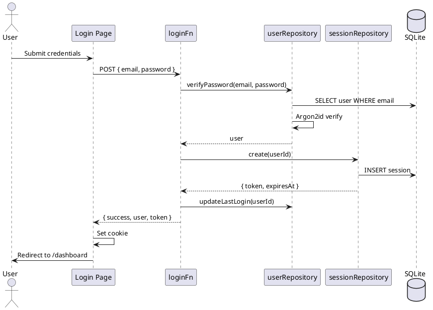
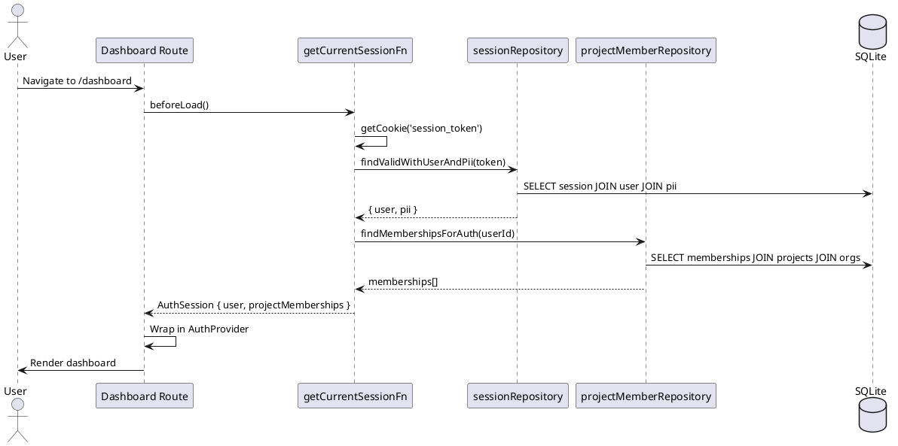
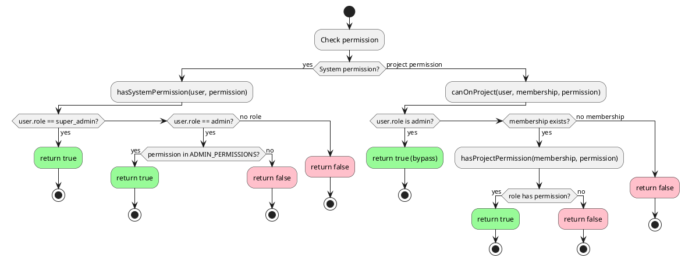
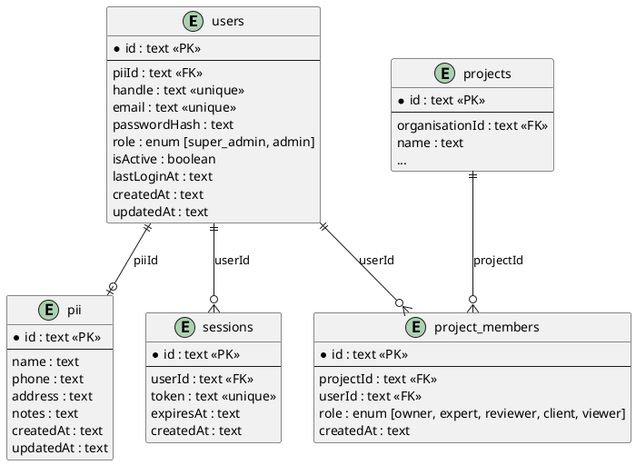

# Authentication & Authorization

This document provides comprehensive documentation of the authentication and authorization system in Orilla Budget.

## Table of Contents

- [Overview](#overview)
- [Quick Reference](#quick-reference)
- [Architecture Diagrams](#architecture-diagrams)
- [Database Schema](#database-schema)
- [Authentication Flow](#authentication-flow)
- [Authorization System](#authorization-system)
- [Route Protection](#route-protection)
- [Permission Checking API](#permission-checking-api)
- [Security Analysis](#security-analysis)
- [Key Files Reference](#key-files-reference)
- [Developer Guide](#developer-guide)

---

## Overview

Orilla Budget uses a **Project-Scoped RBAC** (Role-Based Access Control) system with ABAC (Attribute-Based Access Control) elements.

### Key Concepts

| Concept | Description |
|---------|-------------|
| **System Roles** | Platform-level roles (`super_admin`, `admin`) for administrative access |
| **Project Roles** | Per-project roles (`owner`, `expert`, `reviewer`, `client`, `viewer`) |
| **Permissions** | Granular actions that roles can perform |
| **Session** | Cookie-based authentication with 7-day expiry |

### Design Principles

1. **Unified Identity**: All users are in the `users` table, regardless of role
2. **Project-Scoped Access**: Most permissions are scoped to specific projects
3. **Admin Bypass**: System admins can access all projects
4. **GDPR Compliance**: Personal data separated into `pii` table for right-to-erasure
5. **Permission-Based UI**: Menu items hidden (not disabled) based on permissions

---

## Quick Reference

### System Permissions

| Permission | Description | super_admin | admin |
|------------|-------------|:-----------:|:-----:|
| `users:view` | View all platform users | ✓ | ✓ |
| `users:create` | Create new users | ✓ | ✓ |
| `users:edit` | Edit user accounts | ✓ | ✓ |
| `users:delete` | Delete user accounts | ✓ | ✗ |
| `organisations:view` | View all organisations | ✓ | ✓ |
| `organisations:create` | Create organisations | ✓ | ✓ |
| `organisations:edit` | Edit organisations | ✓ | ✓ |
| `organisations:delete` | Delete organisations | ✓ | ✓ |
| `platform:manage` | Manage platform settings | ✓ | ✗ |

### Project Permissions

| Permission | owner | expert | reviewer | client | viewer |
|------------|:-----:|:------:|:--------:|:------:|:------:|
| `project:view` | ✓ | ✓ | ✓ | ✓ | ✓ |
| `project:edit` | ✓ | | | | |
| `project:delete` | ✓ | | | | |
| `project:invite` | ✓ | | | | |
| `project:manage-members` | ✓ | | | | |
| `time-entries:view` | ✓ | ✓ | ✓ | ✓ | ✓ |
| `time-entries:create` | ✓ | ✓ | | | |
| `time-entries:edit-own` | ✓ | ✓ | | | |
| `time-entries:edit-all` | ✓ | | | | |
| `time-entries:delete-own` | ✓ | ✓ | | | |
| `time-entries:delete-all` | ✓ | | | | |
| `time-sheets:view` | ✓ | ✓ | ✓ | ✓ | ✓ |
| `time-sheets:create` | ✓ | ✓ | | | |
| `time-sheets:edit` | ✓ | ✓ | | | |
| `time-sheets:submit` | ✓ | ✓ | | | |
| `time-sheets:approve` | ✓ | | ✓ | | |
| `contacts:view` | ✓ | ✓ | ✓ | ✓ | |
| `contacts:invite` | ✓ | | | ✓ | |

---

## Architecture Diagrams

### Login Flow



### Session Validation Flow



### Permission Check Flow



### Entity Relationship Diagram



---

## Database Schema

### Users Table

```typescript
export const users = sqliteTable('users', {
  id: text('id').primaryKey(),
  piiId: text('pii_id').references(() => pii.id, { onDelete: 'set null' }),
  handle: text('handle').notNull().unique(),
  email: text('email').notNull().unique(),
  passwordHash: text('password_hash'),
  role: text('role', { enum: ['super_admin', 'admin'] }),
  isActive: integer('is_active', { mode: 'boolean' }).notNull().default(true),
  lastLoginAt: text('last_login_at'),
  createdAt: text('created_at').notNull(),
  updatedAt: text('updated_at').notNull(),
})
```

**Key Points:**
- `role` is nullable - most users have no system role
- `passwordHash` is nullable to support SSO-only users (future)
- `isActive` allows deactivating users without deletion
- `piiId` uses `set null` on delete for GDPR compliance

### Sessions Table

```typescript
export const sessions = sqliteTable('sessions', {
  id: text('id').primaryKey(),
  userId: text('user_id').notNull().references(() => users.id, { onDelete: 'cascade' }),
  token: text('token').notNull().unique(),
  expiresAt: text('expires_at').notNull(),
  createdAt: text('created_at').notNull(),
})
```

**Key Points:**
- Token is 32 random bytes, base64url encoded
- Sessions expire after 7 days
- Cascades on user deletion

### PII Table

```typescript
export const pii = sqliteTable('pii', {
  id: text('id').primaryKey(),
  name: text('name'),
  phone: text('phone'),
  address: text('address'),
  notes: text('notes'),
  createdAt: text('created_at').notNull(),
  updatedAt: text('updated_at').notNull(),
})
```

**Key Points:**
- Separate table for GDPR Article 17 (right to erasure)
- Can delete PII without losing user account
- All fields nullable

### Project Members Table

```typescript
export const projectMembers = sqliteTable('project_members', {
  id: text('id').primaryKey(),
  projectId: text('project_id').notNull().references(() => projects.id, { onDelete: 'cascade' }),
  userId: text('user_id').notNull().references(() => users.id, { onDelete: 'cascade' }),
  role: text('role', { enum: ['owner', 'expert', 'reviewer', 'client', 'viewer'] }).notNull(),
  createdAt: text('created_at').notNull(),
}, (table) => ({
  uniqueMembership: unique().on(table.projectId, table.userId),
}))
```

**Key Points:**
- Bridges users to projects with roles
- Unique constraint prevents duplicate memberships
- Cascades on project or user deletion

---

## Authentication Flow

### 1. Login Process

**File:** `src/routes/login.tsx`

```typescript
// 1. User submits form
const loginFn = createServerFn({ method: 'POST' })
  .inputValidator(LoginSchema)
  .handler(async ({ data }) => {
    // 2. Verify credentials
    const user = await userRepository.verifyPassword(data.email, data.password)
    if (!user) throw new Error('Invalid credentials')

    // 3. Create session
    const session = await sessionRepository.create(user.id)

    // 4. Update last login
    await userRepository.updateLastLogin(user.id)

    // 5. Return token for cookie
    return { success: true, user, token: session.token }
  })

// 6. Client sets cookie
document.cookie = `${SESSION_COOKIE_NAME}=${token}; path=/; max-age=${7 * 24 * 60 * 60}; samesite=lax`

// 7. Redirect to dashboard
router.navigate({ to: '/dashboard' })
```

### 2. Session Validation

**File:** `src/lib/auth/session.server.ts`

```typescript
export const getCurrentSessionFn = createServerFn({ method: 'GET' }).handler(async () => {
  // 1. Get token from cookie
  const token = getCookie(SESSION_COOKIE_NAME)
  if (!token) return { user: null, projectMemberships: [] }

  // 2. Find valid session with user and PII
  const sessionData = await sessionRepository.findValidWithUserAndPii(token)
  if (!sessionData) return { user: null, projectMemberships: [] }

  // 3. Check user is active
  if (!sessionData.user.isActive) return { user: null, projectMemberships: [] }

  // 4. Load project memberships
  const memberships = await projectMemberRepository.findMembershipsForAuth(user.id)

  // 5. Return structured auth session
  return {
    user: { id, handle, email, role, pii: { name } },
    projectMemberships: memberships.map(m => ({
      projectId, projectName, organisationId, organisationName, role
    }))
  }
})
```

### 3. Logout Process

**File:** `src/lib/auth/session.server.ts`

```typescript
export const logoutFn = createServerFn({ method: 'POST' }).handler(async () => {
  const token = getCookie(SESSION_COOKIE_NAME)

  // 1. Delete session from database
  if (token) await sessionRepository.deleteByToken(token)

  // 2. Clear cookie
  setCookie(SESSION_COOKIE_NAME, '', { ...SESSION_COOKIE_OPTIONS, maxAge: 0 })

  return { success: true }
})
```

---

## Authorization System

### System Roles

| Role | Description | Use Case |
|------|-------------|----------|
| `super_admin` | Full platform access | Platform owner |
| `admin` | Limited admin access (no user delete, no platform settings) | Operations staff |
| *(none)* | No system permissions, access via projects only | Regular users |

### Project Roles

| Role | Description | Typical User |
|------|-------------|--------------|
| `owner` | Full project control, can delete project and manage members | Project creator |
| `expert` | Create and edit own time entries, submit time sheets | Freelancer |
| `reviewer` | Approve/reject time sheets, view all entries | Client PM, Finance |
| `client` | View project data, invite contacts | Client stakeholder |
| `viewer` | Minimal read-only access | External viewer |

### Role Hierarchy

```
System Level:
  super_admin → All system + project permissions
  admin → Limited system + all project permissions
  (none) → No system permissions

Project Level (requires membership):
  owner > expert > reviewer > client > viewer
```

**Note:** System admins (`super_admin`, `admin`) bypass all project permission checks. They have implicit access to all project actions even without membership.

---

## Route Protection

### Pattern: beforeLoad Hook

**File:** `src/routes/dashboard.tsx`

```typescript
export const Route = createFileRoute('/dashboard')({
  component: Dashboard,
  beforeLoad: async () => {
    // 1. Check authentication (runs on server)
    const session = await getCurrentSessionFn()

    // 2. Redirect if not authenticated
    if (!session.user) {
      throw redirect({ to: '/login' })
    }

    // 3. Pass auth to component via route context
    return { auth: session }
  },
  loader: () => getAllDataFn(),
})
```

### Auth Context Propagation

```typescript
function Dashboard() {
  // 1. Get auth from route context
  const routeContext = Route.useRouteContext() as { auth: AuthSession }
  const auth = routeContext.auth

  // 2. Wrap in AuthProvider for child components
  return (
    <AuthProvider
      initialUser={auth.user}
      initialMemberships={auth.projectMemberships}
    >
      {/* Children can use useAuth() hook */}
      <Outlet />
    </AuthProvider>
  )
}
```

### Permission-Based UI Visibility

```typescript
function Dashboard() {
  const auth = routeContext.auth

  // Derive permissions from auth (already resolved server-side)
  const canViewUsers = auth.user && hasSystemPermission(auth.user, 'users:view')

  return (
    <Sidebar>
      {/* Always visible */}
      <Link to="/dashboard/time-entries">Time Entries</Link>

      {/* Only visible to admins */}
      {canViewUsers && (
        <Link to="/dashboard/users">Users</Link>
      )}
    </Sidebar>
  )
}
```

---

## Permission Checking API

### hasSystemPermission

Check if user has a system-level permission.

```typescript
import { hasSystemPermission } from '@/lib/permissions'

function hasSystemPermission(
  user: { role?: 'super_admin' | 'admin' | null },
  permission: SystemPermission
): boolean

// Example
const canViewUsers = hasSystemPermission(user, 'users:view')
const canDeleteUsers = hasSystemPermission(user, 'users:delete') // Only super_admin
```

### hasProjectPermission

Check if a project membership grants a permission.

```typescript
import { hasProjectPermission } from '@/lib/permissions'

function hasProjectPermission(
  membership: { role: ProjectRole },
  permission: ProjectPermission
): boolean

// Example
const canApprove = hasProjectPermission(membership, 'time-sheets:approve')
```

### canOnProject

Combined check: admin bypass + project membership.

```typescript
import { canOnProject } from '@/lib/permissions'

function canOnProject(
  user: { role?: SystemRole | null },
  projectMembership: { role: ProjectRole } | null,
  permission: ProjectPermission
): boolean

// Example - admins can always access, others need membership
const canEdit = canOnProject(user, membership, 'time-entries:edit-all')
```

### Using in Components

```typescript
import { useAuth } from '@/hooks/useAuth'

function TimeEntryActions({ projectId, entry }) {
  const { user, canOnProject, getProjectMembership } = useAuth()

  const membership = getProjectMembership(projectId)
  const canEditAll = canOnProject(projectId, 'time-entries:edit-all')
  const canEditOwn = canOnProject(projectId, 'time-entries:edit-own')
  const isOwner = entry.userId === user?.id

  const canEdit = canEditAll || (canEditOwn && isOwner)

  return canEdit ? <EditButton /> : null
}
```

---

## Security Analysis

### Password Security

**Algorithm:** Argon2id (winner of Password Hashing Competition)

**Configuration:**
```typescript
// src/lib/auth.ts
Bun.password.hash(password, {
  algorithm: 'argon2id',
  memoryCost: 19456,  // 19 MiB
  timeCost: 2,        // 2 iterations
})
```

**Rationale:**
- Memory-hard function resistant to GPU attacks
- 19 MiB memory prevents parallel attacks
- OWASP recommended algorithm

### Session Security

**Token Generation:**
```typescript
const bytes = crypto.getRandomValues(new Uint8Array(32))
const token = base64url.encode(bytes)  // 43 characters
```

**Entropy:** 256 bits (2^256 possible tokens)

**Cookie Configuration:**
```typescript
{
  httpOnly: true,        // Prevents XSS token theft
  secure: true,          // HTTPS only in production
  sameSite: 'lax',       // CSRF protection
  maxAge: 7 * 24 * 3600, // 7 days
  path: '/',
}
```

### Access Control

1. **Active User Check:** Deactivated users (`isActive: false`) cannot authenticate
2. **Session Expiry:** Sessions automatically expire after 7 days
3. **Admin Bypass:** System admins have implicit access to all projects
4. **Cascading Deletes:** Deleting a user removes all their sessions

### GDPR Compliance

1. **PII Separation:** Personal data in separate `pii` table
2. **Right to Erasure:** Can delete `pii` row while preserving user account for audit
3. **Foreign Key:** `piiId` uses `SET NULL` on delete

---

## Key Files Reference

| File | Purpose |
|------|---------|
| `src/lib/auth.ts` | Password hashing (`hashPassword`, `verifyPassword`), token generation (`generateSessionToken`), ID generation (`generateId`), session utilities |
| `src/lib/auth.shared.ts` | Cookie constants (`SESSION_COOKIE_NAME`, `SESSION_COOKIE_OPTIONS`) - safe for client |
| `src/lib/auth/types.ts` | Type definitions: `AuthenticatedUser`, `ProjectMembership`, `AuthSession`, `AuthContextValue` |
| `src/lib/auth/session.server.ts` | Server functions: `getCurrentSessionFn`, `logoutFn` |
| `src/lib/permissions.ts` | Permission definitions, role mappings, checking functions |
| `src/components/auth-provider.tsx` | React context provider for auth state |
| `src/hooks/useAuth.ts` | Hook to access auth context |
| `src/routes/login.tsx` | Login page with form and `loginFn` |
| `src/routes/dashboard.tsx` | Protected dashboard with `beforeLoad` auth check |
| `src/repositories/user.repository.ts` | User CRUD, `verifyPassword`, `createWithPassword` |
| `src/repositories/session.repository.ts` | Session CRUD, `findValidWithUserAndPii` |
| `src/repositories/projectMember.repository.ts` | Membership CRUD, `findMembershipsForAuth` |
| `src/db/schema.ts` | Database schema definitions |

---

## Developer Guide

### How to Protect a New Route

```typescript
// src/routes/my-route.tsx
import { createFileRoute, redirect } from '@tanstack/react-router'
import { getCurrentSessionFn } from '@/lib/auth/session.server'

export const Route = createFileRoute('/my-route')({
  component: MyComponent,
  beforeLoad: async () => {
    const session = await getCurrentSessionFn()
    if (!session.user) {
      throw redirect({ to: '/login' })
    }
    return { auth: session }
  },
})
```

### How to Check Permissions in Components

```typescript
import { hasSystemPermission } from '@/lib/permissions'

function MyComponent() {
  const routeContext = Route.useRouteContext() as { auth: AuthSession }
  const { user, projectMemberships } = routeContext.auth

  // System permission check
  const isAdmin = user && hasSystemPermission(user, 'users:view')

  // Project permission check
  const membership = projectMemberships.find(m => m.projectId === projectId)
  const canEdit = membership && hasProjectPermission(membership, 'project:edit')

  return (
    <>
      {isAdmin && <AdminPanel />}
      {canEdit && <EditButton />}
    </>
  )
}
```

### How to Add a New Permission

1. **Add to permission constants** (`src/lib/permissions.ts`):
```typescript
export const PROJECT_PERMISSIONS = {
  // ... existing
  'reports:view': 'View project reports',
  'reports:export': 'Export project reports',
} as const
```

2. **Map to roles**:
```typescript
export const PROJECT_ROLE_PERMISSIONS: Record<ProjectRole, ProjectPermission[]> = {
  owner: [
    // ... existing
    'reports:view',
    'reports:export',
  ],
  expert: [
    // ... existing
    'reports:view',  // experts can view but not export
  ],
  // ...
}
```

3. **Add tests** (`src/lib/permissions.test.ts`):
```typescript
it('owner can export reports', () => {
  expect(hasProjectPermission({ role: 'owner' }, 'reports:export')).toBe(true)
})

it('expert cannot export reports', () => {
  expect(hasProjectPermission({ role: 'expert' }, 'reports:export')).toBe(false)
})
```

### How to Add a New Role

1. **Update schema** (`src/db/schema.ts`):
```typescript
role: text('role', { enum: ['owner', 'expert', 'reviewer', 'client', 'viewer', 'contractor'] })
```

2. **Update Zod schema** (`src/schemas.ts`):
```typescript
export const projectRoleSchema = z.enum(['owner', 'expert', 'reviewer', 'client', 'viewer', 'contractor'])
```

3. **Add role permissions** (`src/lib/permissions.ts`):
```typescript
export const PROJECT_ROLE_PERMISSIONS = {
  // ... existing
  contractor: [
    'project:view',
    'time-entries:view',
    'time-entries:create',
    'time-entries:edit-own',
  ],
}
```

4. **Generate migration**:
```bash
bun run db:generate
bun run db:migrate
```

### Testing Auth Code

```typescript
// src/lib/permissions.test.ts
import { describe, it, expect } from 'bun:test'
import { hasSystemPermission, hasProjectPermission } from './permissions'

describe('permissions', () => {
  it('super_admin has all system permissions', () => {
    expect(hasSystemPermission({ role: 'super_admin' }, 'users:delete')).toBe(true)
  })

  it('admin cannot delete users', () => {
    expect(hasSystemPermission({ role: 'admin' }, 'users:delete')).toBe(false)
  })

  it('expert can create time entries', () => {
    expect(hasProjectPermission({ role: 'expert' }, 'time-entries:create')).toBe(true)
  })
})
```

Run tests:
```bash
bun test src/lib/permissions.test.ts
bun test src/lib/auth.test.ts
```
